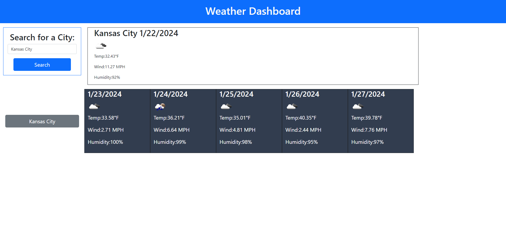

# Weather Dashboard

## Description

This is a weather dashboard app. You are able to enter the name of a city into the search bar, which then uses the OpenWeather API to generate a 5 day weather forecast. Your search will be saved in local storage and can easily be accessed again right under the search
bar. Each day of the forecast provides you with the date using dayJS, temp, wind, humidity, and an icon representing the current conditions.

## Usage

https://rb2277.github.io/weather-dashboard/

## Credits

Credit to samu101108 on https://stackoverflow.com/questions/44177417/how-to-display-openweathermap-weather-icon for the Icon code

## License

N/A
